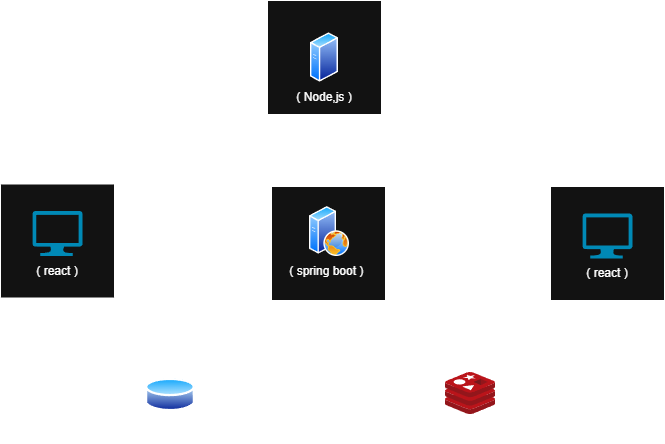

# Synergy - Real-Time Expert Communication Platform

Synergy is a **real-time expert consultation platform** that enables users to discover online experts by domain and communicate with them through **chat, voice, and video** — all within a single unified session.

The platform is built with a **multi-server architecture**, separating core application logic from real-time media signaling to ensure scalability, clarity, and performance.

Synergy allows users to:
- Search for experts based on specific domains (e.g., Computer Science, Design, Consulting)
- View experts who are currently **online**
- Initiate real-time communication sessions
- Chat, voice call, and video call **simultaneously within one session**
- End sessions cleanly and return to the main application flow

The system is designed to reflect **real-world expert consultation platforms** with proper session handling and real-time communication pipelines.

## Key Features

- 🔍 **Expert Discovery** — Search and filter experts by domain  
- 🟢 **Online Presence Tracking** — See experts available in real time  
- 💬 **Real-Time Chat** — Implemented using Spring WebSockets  
- 🎥 **Video Calling** — Peer-to-peer communication via WebRTC  
- 🔊 **Voice Calling** — Integrated alongside video and chat  
- 🔐 **Authentication & Security** — JWT-based authentication using Spring Security  
- ⚡ **Low-Latency Communication** — Redis-backed call/session handling  
- 🧩 **Multi-Server Architecture** — Separate signaling and application servers  

## System Architecture



*High-level architecture showing separation between application logic, WebRTC signaling, and peer-to-peer media flow.*

Synergy uses **two backend servers**, each with a clearly defined responsibility.

### 🔹 Spring Boot (Main Application Server)
Responsible for:
- User & expert management
- Authentication (JWT via Spring Security)
- Expert search & online availability
- Session lifecycle orchestration
- Real-time chat using WebSockets
- Persistent storage using MySQL
- **Call and session state management using Redis**

### 🔹 Node.js (WebRTC Signaling Server)
Responsible for:
- WebRTC signaling
- Peer connection setup
- SDP exchange
- ICE candidate negotiation

> **Note:** Audio and video streams do **not** pass through backend servers.  
> Media flows directly between clients using **WebRTC peer-to-peer connections**.

## Communication Flow

1. User searches for experts by domain  
2. Backend returns a list of **online experts**  
3. User initiates a call request  
4. Expert accepts the request  
5. WebRTC signaling occurs via the Node.js signaling server  
6. A session is created and tracked by the Spring Boot server  
7. Chat (WebSocket), voice, and video (WebRTC) run in parallel  
8. Session ends and users are redirected back to the application  

## Tech Stack

<p align="left">
  
</p>

### Frontend
- React
- Tailwind CSS

### Backend
- Spring Boot
- Spring Security (JWT Authentication)
- Node.js (WebRTC signaling server)

### Databases & Caching
- MySQL (Primary persistent database)
- Redis (Call and session lifecycle management)

### Real-Time Technologies
- WebSockets (Text chat)
- WebRTC (Audio & video communication)

## Authentication

- JWT-based authentication implemented using **Spring Security**
- Secure token-based authorization for protected routes
- OAuth integration planned for future releases

## Local HTTPS Setup Guide

> **Important Security Notice**
>
> - Synergy requires **HTTPS** for WebRTC to function correctly
> - All services (Spring Boot, Node.js signaling server, React frontend) run over HTTPS
> - You must generate your **own certificates and keystore** for local development
> - All secrets and credentials shown here are **development-only** — never use in production

### Prerequisites

Ensure the following are installed on your system:

- **Java 17+**
- **Node.js 18+**
- **MySQL 8+**
- **Redis**
- **OpenSSL**
- **Git**

### 1. Clone the Repository

```bash
git clone https://github.com/Roshan21424/web-synergy-p.git
cd web-synergy-p
```

### 2. Generate HTTPS Certificates

Create a directory for certificates:

```bash
mkdir certs
cd certs
```

Generate a private key:

```bash
openssl genrsa -out key.pem 2048
```

Generate a self-signed certificate (valid for 10 years):

```bash
openssl req -new -x509 -key key.pem -out cert.pem -days 3650
```

When prompted, fill in the certificate details. For `Common Name (CN)`, use `localhost`.

### 3. Create Spring Boot Keystore (PKCS12)

From the `certs` directory, create a PKCS12 keystore:

```bash
openssl pkcs12 -export -in cert.pem -inkey key.pem -out keystore.p12 -name localhost
```

You'll be prompted to set a password. **Remember this password** — you'll need it in the Spring Boot configuration.

Move the keystore to Spring Boot resources:

```bash
mv keystore.p12 ../backend/synergy-api/src/main/resources/
cd ..
```

### 4. Start Required Services

#### Start MySQL

Start your MySQL server and create the database:

```sql
CREATE DATABASE synergy;
```

#### Start Redis

```bash
redis-server
```

### 5. Configure Spring Boot (HTTPS)

Edit: `backend/synergy-api/src/main/resources/application.properties`

```properties
# Server Configuration
server.port=8080
server.ssl.enabled=true
server.ssl.key-store=classpath:keystore.p12
server.ssl.key-store-password=YOUR_KEYSTORE_PASSWORD
server.ssl.key-store-type=PKCS12
server.ssl.key-alias=localhost

# Database Configuration
spring.datasource.url=jdbc:mysql://localhost:3306/synergy
spring.datasource.username=YOUR_DB_USER
spring.datasource.password=YOUR_DB_PASSWORD

# Redis Configuration
spring.data.redis.host=localhost
spring.data.redis.port=6379
```

Replace:
- `YOUR_KEYSTORE_PASSWORD` with the password you set when creating the keystore
- `YOUR_DB_USER` and `YOUR_DB_PASSWORD` with your MySQL credentials

### 6. Run Spring Boot Backend

Navigate to the backend directory and start the application:

```bash
cd backend/synergy-api
./mvnw spring-boot:run
```

**Windows users:**

```bash
mvnw.cmd spring-boot:run
```

The backend will run at: **https://localhost:8080**

### 7. Configure & Run Node.js WebRTC Signaling Server (HTTPS)

Create a `.env` file in `backend/signaling-server/`:

```bash
cd backend/signaling-server
```

Create `.env` file with the following content:

```env
PORT=3001
HTTPS=true
SSL_KEY_FILE=../../certs/key.pem
SSL_CERT_FILE=../../certs/cert.pem
```

Install dependencies and start the server:

```bash
npm install
npm start
```

The signaling server will run at: **https://localhost:3001**

### 8. Configure & Run React Frontend (HTTPS)

Create a `.env` file in `frontend/react-client/`:

```bash
cd frontend/react-client
```

Create `.env` file with the following content:

```env
HTTPS=true
SSL_CRT_FILE=../../certs/cert.pem
SSL_KEY_FILE=../../certs/key.pem
REACT_APP_SERVER_URL=https://localhost:8080
REACT_APP_SIGNALING_URL=https://localhost:3001
```

Install dependencies and start the frontend:

```bash
npm install
npm start
```

The frontend will run at: **https://localhost:3000**

### 9. Access the Application

Open your browser and navigate to:

**https://localhost:3000**

#### Expected Browser Warning

You'll see a security warning because you're using a self-signed certificate. This is normal for local development.

**To proceed:**
- **Chrome/Edge:** Click "Advanced" → "Proceed to localhost (unsafe)"
- **Firefox:** Click "Advanced" → "Accept the Risk and Continue"
- **Safari:** Click "Show Details" → "visit this website"

#### Testing WebRTC Features

To test chat, voice, and video communication:

1. Open **two browser windows** (or one normal and one incognito)
2. Log in as different users (user and expert roles)
3. Initiate a session to test real-time communication features

## 🔧 Troubleshooting

### Certificate Issues

If you encounter certificate errors across services:
- Ensure all `.env` files point to the correct certificate paths
- Verify certificate permissions (should be readable by the application)
- Regenerate certificates if they've expired

### Port Already in Use

If any port (3000, 3001, 8080) is already in use:
- Kill the process using that port, or
- Change the port in the respective configuration files

### Database Connection Errors

- Verify MySQL is running: `mysql -u YOUR_DB_USER -p`
- Ensure the `synergy` database exists
- Check credentials in `application.properties`

### Redis Connection Errors

- Verify Redis is running: `redis-cli ping` (should return `PONG`)
- Check if Redis is running on the default port 6379

## Project Structure

```
web-synergy-p/
├── certs/                          # SSL certificates
│   ├── cert.pem
│   ├── key.pem
│   └── keystore.p12 (moved)
├── backend/
│   ├── synergy-api/               # Spring Boot API
│   │   └── src/main/resources/
│   │       ├── application.properties
│   │       └── keystore.p12
│   └── signaling-server/          # WebRTC signaling
│       ├── .env
│       └── server.js
└── frontend/
    └── react-client/              # React frontend
        ├── .env
        └── src/
```

## Security Reminders

- **Never commit** `.env` files, certificates, or keystores to version control
- Add to `.gitignore`:
  ```
  *.pem
  *.p12
  .env
  ```
- Regenerate all certificates and secrets before deploying to production
- Use proper CA-signed certificates in production environments

## Future Improvements

- OAuth-based authentication
- Expert scheduling & availability slots
- Payments and monetization
- Session recording
- Expert ratings and reviews
- Horizontal scaling and load balancing
- Dockerized deployment

## Contributions

Contributions, suggestions, and improvements are welcome.  
Feel free to open an issue or submit a pull request.

**Happy coding!**
